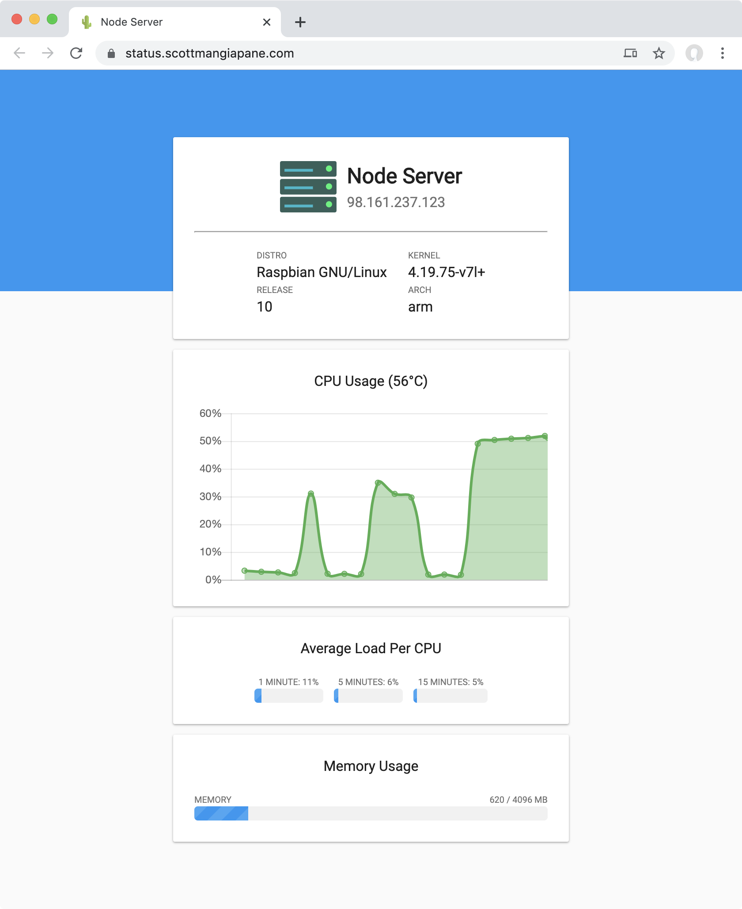

## Server Monitoring

This project is a Node.js webserver that displays important system information.

## Getting Started

* Clone this repo
* Install dependencies with `npm install`
* Launch the server with `npm run start`
* [PM2](https://pm2.keymetrics.io/) is recommended to start the server on boot

## Live demo

https://status.scottmangiapane.com/

## Screenshots

